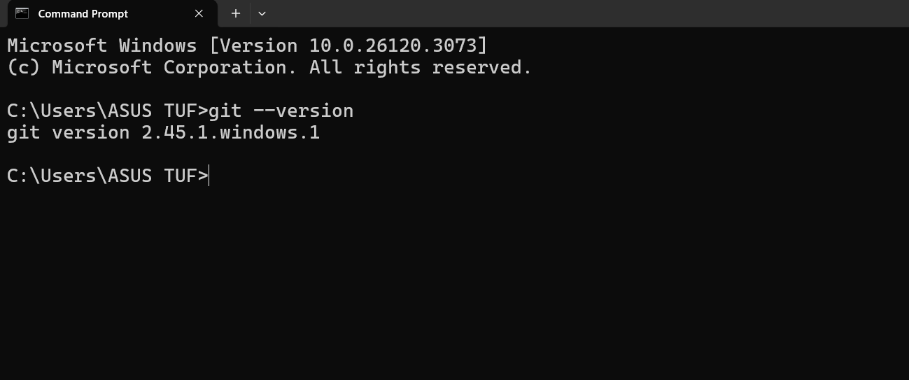
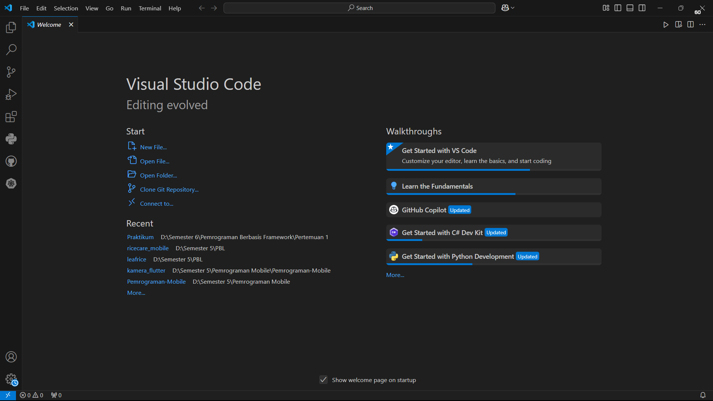
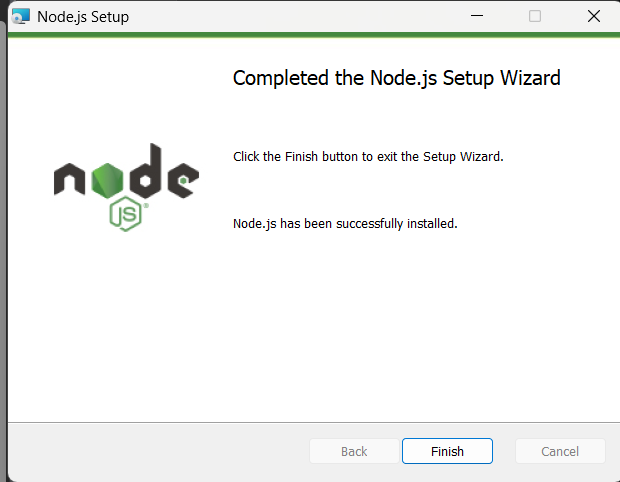
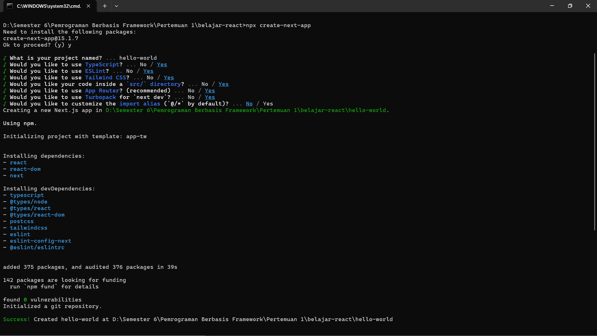
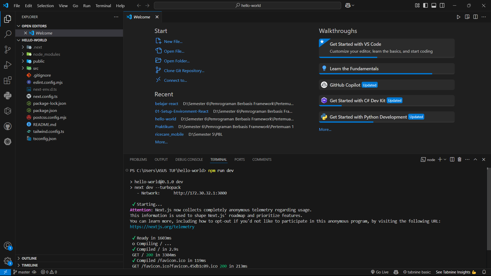
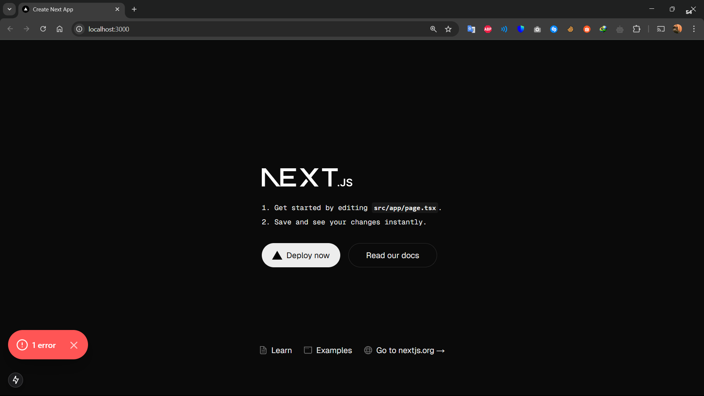

# 01-Setup-Environment-React
2241720193 - Rio Bagas Hermawan - Pembelajaran Berbasis Framework 2025

## Laporan Praktikum

|  | Pemrograman Berbasis Framework 2024 |
|--|--|
| NIM |  2241720193|
| Nama |  Rio Bagas Hermawan |
| Kelas | TI - 3D |

# Praktikum 1 : Menyiapkan Lingkungan Pengembangan 

### Pertanyaan Praktikum 1

1. Jelaskan kegunaan masing-masing dari Git, VS Code dan NodeJS yang telah Anda install 
pada sesi praktikum ini! 

2. Buktikan dengan screenshoot yang menunjukkan bahwa masing-masing tools tersebut 
telah berhasil terinstall di perangkat Anda!

### Jawaban Praktikum 1

1. Penjelasan

Git 
Git digunakan untuk mengelola versi kode, melacak perubahan, dan memfasilitasi kolaborasi dalam pengembangan perangkat lunak

VS Code 
VS Code adalah editor kode yang mendukung berbagai bahasa pemrograman dengan berbagai fitur dan ekstensi untuk mempercepat pengembangan. 

Node.js 
Node.js memungkinkan eksekusi JavaScript di luar browser, digunakan untuk membuat backend server dan mengelola package dengan npm. Ketiga tools ini penting dalam pengembangan berbasis framework, terutama React.js.

2. Bukti Screenshot
#### Instalasi Git

#### Instalasi VSCode

#### Instalasi NodeJS

# Praktikum 2: Membuat Proyek Pertama React Menggunakan Next.js 

### Pertanyaan Praktikum 2

1. Pada Langkah ke-2, setelah membuat proyek baru menggunakan Next.js, terdapat beberapa 
istilah yang muncul. Jelaskan istilah tersebut, TypeScript, ESLint, Tailwind CSS, App 
Router, Import alias, App router, dan Turbopack! 

2. Apa saja kegunaak folder dan file yang ada pada struktur proyek React yang tampil pada 
gambar pada tahap percobaan ke-3! 

3. Buktikan dengan screenshoot yang menunjukkan bahwa tahapan percobaan di atas telah 
berhasil Anda lakukan!

### Jawaban Praktikum 2

1. Penjelasan
TypeScript
versi lebih canggih dari JavaScript yang dilengkapi dengan sistem tipe statis.
Dengan TypeScript, kesalahan dalam kode dapat dideteksi sebelum dijalankan,
sehingga membuat pengembangan lebih aman dan mudah dikelola.

ESLint
alat yang berfungsi untuk memastikan kualitas kode JavaScript dan 
TypeScript dengan memberikan peringatan terhadap kesalahan atau inkonsistensi 
dalam penulisan kode.

Tailwind CSS
merupakan framework CSS berbasis utility-first yang memungkinkan pengembang 
langsung menerapkan gaya pada elemen HTML tanpa perlu menulis file CSS terpisah.

App Router
adalah sistem routing terbaru di Next.js yang menggunakan direktori app/ sebagai dasar
navigasi aplikasi. Metode ini lebih fleksibel dibandingkan sistem sebelumnya (pages/), 
mendukung fitur seperti server components, layout yang lebih efisien, dan loading UI bawaan.

Import alias
Import alias memungkinkan penggunaan nama pendek yang lebih mudah diingat saat mengimpor 
file atau modul dalam proyek, sehingga meningkatkan keterbacaan dan manajemen kode.

Turbopack
Turbopack adalah bundler inkremental yang terintegrasi dengan Next.js. 
Turbopack dapat digunakan untuk mempercepat pengembangan lokal aplikasi Next.js

2. Penjelasan
node_modules/
Berisi semua dependensi (library dan package) yang diinstal melalui npm atau yarn. 
Folder ini dibuat secara otomatis setelah menjalankan perintah npm install atau yarn install.

public/
Berisi aset statis seperti gambar, ikon, atau file HTML utama (index.html) yang tidak diproses oleh Webpack.

src/
Berisi semua kode sumber aplikasi React, termasuk komponen, halaman, dan konfigurasi utama.

3. Bukti Screenshots

#### Membuat Proyek Baru

#### Running Proyek Hello World

#### Tampilan Browser 

# Praktikum 3

### Pertanyaan Praktikum 3

1. Buktikan dengan screenshoot yang menunjukkan bahwa tahapan percobaan di atas telah 
berhasil Anda lakukan! 

### Jawaban Praktikum 3

# Praktikum 4 

### Pertanyaan Praktikum 4

1. Untuk apakah kegunaan sintaks user.imageUrl? 

2. Buktikan dengan screenshoot yang menunjukkan bahwa tahapan percobaan di atas telah 
berhasil Anda lakukan! 

### Jawaban Praktikum 4
